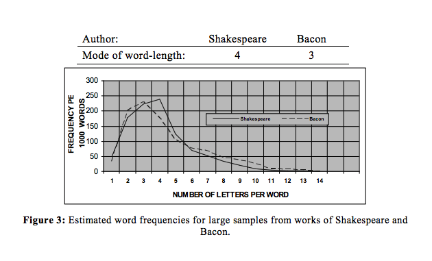
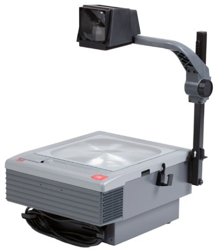
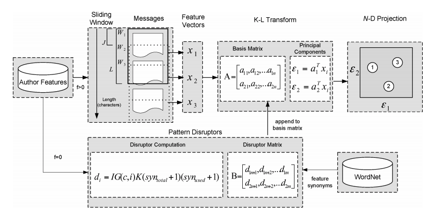
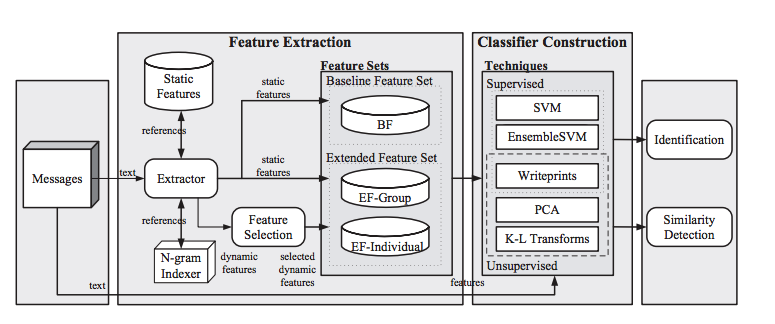
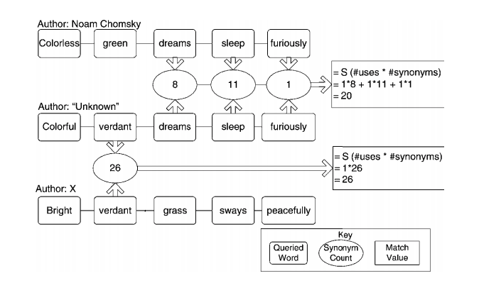
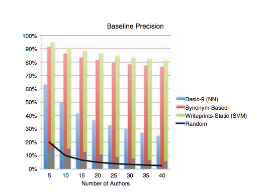
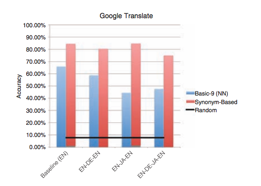
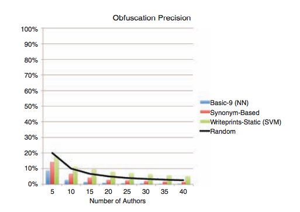
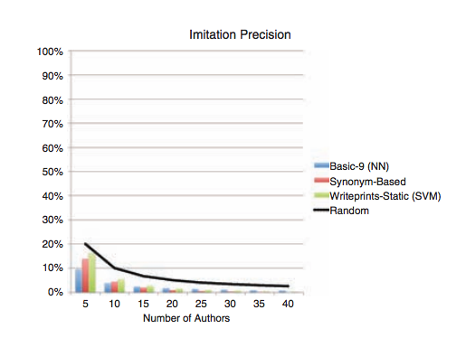

# Stylometry
Statistical analysis for authorship identification

xander@splunk.com

January 18th 2018

---

# Contents

* Definition
* Historical Methods & Citations Galore
* Hapax Legomena
* The Queen Sues Everyone
* Adolescent Neural Networks
* J.K. Rowling can't trick us 
* Murder or Suicide!?
* Bad Lord of the Rings Analogies
* Questions / wake up time

---

Google:

> " the statistical analysis of variations in literary style between one writer or genre and another.” 

----

Wikipedia:

> "Stylometry is the application of the study of linguistic style, usually to written language, but it has successfully been applied to music and to fine-art paintings as well. Stylometry is often used to attribute authorship to anonymous or disputed documents."

---

## Why

### What is it for?
* Verifying authorship and authenticity of a given text
* Used to determine authorship or authenticity in
    * Literary, social, and historical studies
    * Forensic applications
    * Plagiarism detection
    * Dissident detection
    * Identity fraud detection
    * HR Violations

---

## Assumptions

* Writing style is composed of two parts
    * Conscious aspects
    * Unconscious aspects

* Unconscious aspects are exposed
    * Independently of the author’s will
    * Cannot be consciously manipulated

* Similar
    * Corpus size
    * Genre
    * Representativeness

---

# Medley of Methods

* 1887 - count them lengths
* 1932 - wait there are constants
* 1964 - function words are cool
* 1987 - PCA on top of that makes pretty graphs
* 1991 - a great tool for suing people
* 1993 - baby nets
* 1995 - constants?
* 1997 - no constants!
* 2005 - markedness
* 2012 - trolling the NSA

---

# 1887

* Relative word length frequencies
* The Characteristic Curves of Composition - Mendenhall
* Shakespare, Marlowe

----



<small> Image from Dabagh (2007) </small>

---

# 1932

* "Constants" in vocabulary distributions
* Selected Studies of the Principle of Relative Frequency in Language - Zipf
* Influenced a lot of studies in stylometry that use constants

----

## Zipf's Law

> The frequency of any word is inversely proportional to its rank the frequency table

* discrete "cousin" of pareto distribution (think 80/20 rule)
    * proteins in genomes
    * income rankings
    * population rankings of cities
* the most frequent word occurs approximately twice as often as the second most frequent word

----


----


---

# 1964 
* Relative function word frequencies, priors
* Inference and Disputed Authorship: The Federalist Papers - Mosteller & Wallace
* Madison vs Hamilton

---

# 1987

* Principal Component Analysis
* Word-Patterns and Story-Shapes: The Statistical Analysis of Narrative Style - Burrows
* Built on Mostellers & Wallace's function words

----


<small>
Persuasion (Austen), The Awkward Age (James), Frederica (Heyer), Howards End (Forster)
</small>

---

# 1991

* Cumulative Sum (Cusum) of various word classes
* Proper Words in Proper Places - Morten 
* Got really popular
    * The Queen vs. Thomas McCrossen (Court of Appeal 1991) 
    * The Queen vs. Frank Beck (Leicester Crown Court 1992)
    * The Queen vs. Joseph Nelson-Wilson (London 1992)

----

>To decide whether the two charts "match" on a cusum plot, Morton advocates the use of a transparent overlay of the habit cusum graph so that it may be moved around with respect to the sentence-length cusum graph... Mort claims that this approach is easy for juries to understand...

* Forensic Stylometry: A Review of the Cusum Controversy
* Holmes 1995 

----

 

----

zero statistical rigor
# TERRIBLE
* also tried to use hapax legomena as a method
* "not chill, bro" - ALL the other statisticians


----


----

>“[Morten] was challenged on live British television to attribute texts that he had never seen. The result was disastrous; despite his impressive statistics and his fancy computer graphics, Morton could not distinguish between the writings of a convicted felon and the Chief Justice of England” 

---

# 1993

* Neural Nets - Multilayer Perceptron
* Neural Computation in Stylometry - Matthews & Merriam
* Shakespeare, Fletcher, Marlowe
* Function word features
* 5 inputs, 1 hidden layer, sigmoid activation

----


----


---

# 1995

* Constants, clustering, genetic rules
* The Federalist Revisited: New Directions in Authorship Attribution - Holmes
* "Vocabulary richness" based off constants as features
    * PCA + Linear Discriminant Analysis

---

# 1997

* Constants?
* How Variable Maye a Constant Be? - Tweedie & Baayen (1998) 
* Prooved that many constants vary considerably with text length
    * many are not even theoretically sound
    * ain't no bag o'words!

---

# Losing Anonymity 

---

## The Cuckcoo's Calling
by Robert Galbraith... Or J.K. Rowling ¯\\\_(ツ)\_/¯ 

* Reporter gets tip, contacts Dr. Patrick Juola
    * author of stylometry books and software
* Compared 4 female british crime novelists
* 4 features with JGAAP
    * Distribution of word lengths (Mendelhall!)
    * 100 most common words (Mosteller & Wallace!)
    * 4-grams and bigrams distributions

----

> If Rowling wasn’t the author, then the tipster had only about a 6% chance of naming someone that consistently similar.

---

## Digital Crime

<small> from the institue for linguistic evidence: </small>

* young, healthy man found dead in his own bed
* roommate notifies police
* autopsy shows death by injection
    * potential homicide
* suicide notes found on computer


----

# 2005

* Syntatic markedness + LDA
    * average word length
    * punctuation at end-of-clause points
    * marked vs. unmarked
        * claim 95% accuracy
* "Who's At the Keyboard?" - Chaski 2002
* International Journal of Digital Evidence

----

## Markedness

* the dead phoenix
* the phoenix that is dead

* phrases
    * noun - head position
    * verb - aspect / form
    * adjective - predicative / attributive
    * modifier - perdicate attachment
    * preposition - recusive

----

# Guilty

* syntatic results presented in court (in addition)
* roomate arrested, charged, tried
    * first degree murder
* pled not guilty
    * confessed to writing the suicide notes

---

<!-- .slide: data-background="img/lotr.jpg" -->

# Hobbit Asylum

```
# This is from Journal of Law and Policy (2013) Volume XXI No. 2
# Stylometry and Immigration: A Case Study - Juola

* bilbo baggins is a citizen of mordor, lives in USA
    * facing immigration issues - to be deported soon
    * seeks political asylumdue to being a published activist against sauron
    * fears conseqeuences if he is forcibly repatriated
```

```
evidence:
    * offers articles he wrote for an elvish language newspaper
    * also has antigovernment writings of late written anonymously in USA

case:
    * prove new documents match old documents so that he can get asylum

result:
    * bilbo granted asylum
```

---

# 2008

* Use all the features + ensemble SVMs
* Writeprints: A Stylometric Approach to Identity-Level Identification and Similarity Detection in Cyberspace - Abbasi
* Hundreds of features ngrams, bigrams, trigrams, function words
    * KL-Decomposition on sliding windows 
    * Preserve zero-usage features

----



----



---

# Adversarial Stylometry

* double edged sword
* what about the
    * whistle blowers
    * oppressive regimes

----

# 2011

* _Inside Wikileaks_ by Daniel Domscheitt-Berg
* Former Wikileaks spokesman
* Attends Adversarial stylometry presentation
* Chaos Communication Congress  (26th)

> “If someone had run WikiLeaks documents through such a program, he would have discovered that the same two people were behind all the various press releases, document summaries, and correspondence issued by the project. The official number of volunteers we had was also, to put it mildly, grotesquely exaggerated.”

---

# 2012

Adversarial Stylometry: Circumventing Authorship Recognition
to Preserve Privacy and Anonymity - Brennan & Greendstadt

* classification methods
    * Kernel SVM
    * Neural Nets
    * Synonym feature vectors  + "basic 9"

* obfuscation methods
    * obfuscation - ok
    * imitation - pretty good
    * cyclic translation - not so good

* corpus made available, study replicated
* YOU CAN STILL HIDE

----

## Synonym feature vectors



----

## Results

 
 

 
 

----

## Adversarial Adversarial Recursion 

* but what about the terrorists
    * who used the adversarial technique

* imposes limits on acceptable corpora

* Anonymouth
    * github.com/psal/anonymouth

---

# Questions

slides at github.com/metasyn/stylometry-talk

xander@splunk.com

